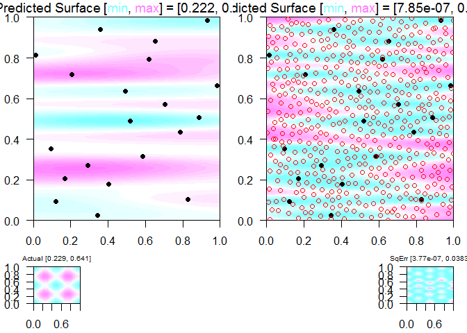
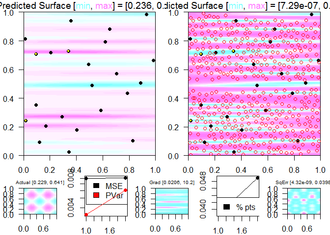
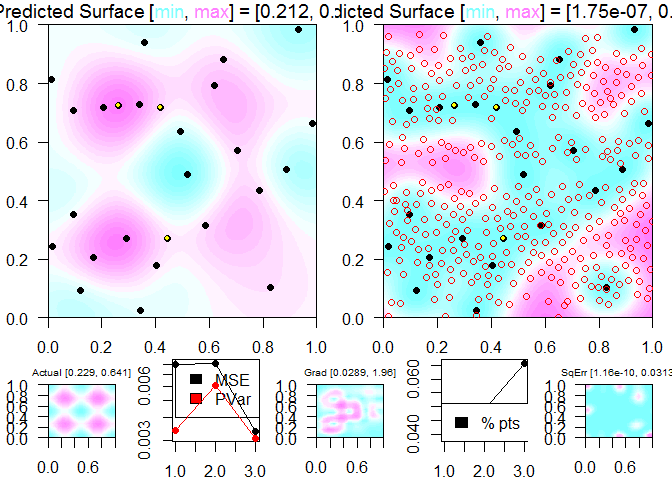
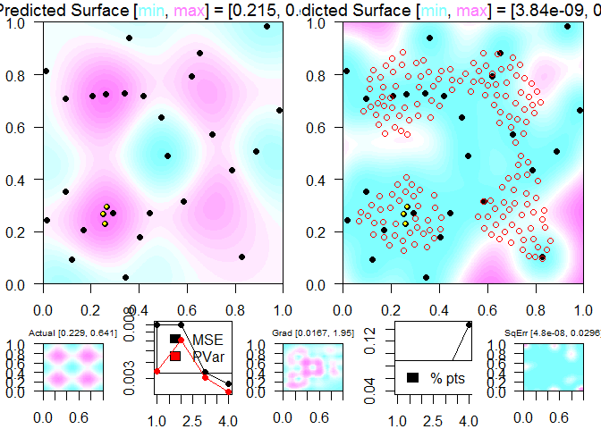
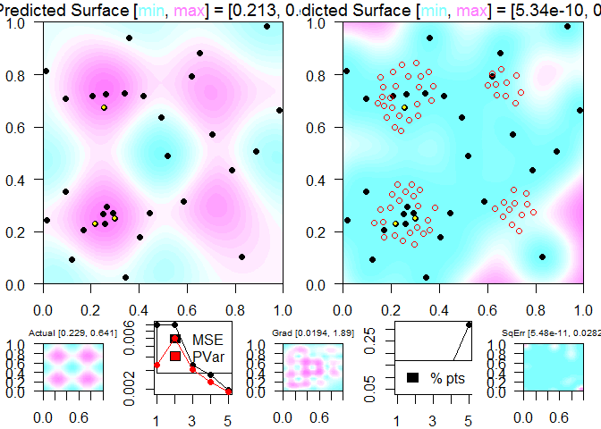

<!-- README.md is generated from README.Rmd. Please edit that file -->
bSMED
=====

[](https://travis-ci.org/CollinErickson/bSMED)

This package implements the adaptive sampling algorithm from the paper "Batch Sequential Minimum Energy Design with Design-Region Adaptation" by Heeyoung Kim et al. (2017), published in Journal of Quality Technology Vol. 49, No. 1, January 2017.

I have used the abbreviation `bSMED` to refer to this method. The main function provided by this package is the `bSMED` function, which creates an R6 object that performs the algorithm.

Installation
------------

You can install bSMED from github with:

``` r
# install.packages("devtools")
devtools::install_github("CollinErickson/bSMED")
```

Example
-------

See the vignette for a more in-depth description of the following example.

This is a basic example which shows you how to solve a common problem:

``` r
## basic example code

# Get function
quad_peaks_slant <- TestFunctions::add_linear_terms(function(XX) {.2+.015*TestFunctions::add_zoom(TestFunctions::rastrigin, scale_low = c(.4,.4), scale_high = c(.6,.6))(XX)^.9}, coeffs = c(.02,.01))

# Create bSMED instance
a <- bSMED::bSMED$new(D=2,func=quad_peaks_slant,
                      obj="func", b=3, nb=5,
                      X0=lhs::maximinLHS(20,2),
                      Xopts=lhs::maximinLHS(500,2),
                      package="GauPro"
                      )
a$run()
```



    #> Best design point is
    #>       0.262 0.725 
    #>  with objective value
    #>       0.628346 
    #> Best predicted point over domain is 
    #>       0.257 0.744 
    #>  with objective value
    #>       0.6317774
